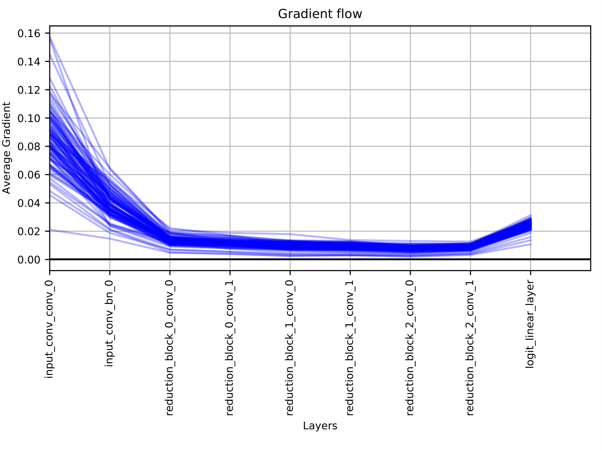

# Machine Learning Practical

This repository contains the code for the University of Edinburgh [School of Informatics](http://www.inf.ed.ac.uk) course [Machine Learning Practical](http://www.inf.ed.ac.uk/teaching/courses/mlp/).

This assignment-based course is focused on the implementation and evaluation of machine learning systems. Students who do this course will have experience in the design, implementation, training, and evaluation of machine learning systems.

# CIFAR Classification
The aim of this coursework is to explore the classification of images using convolutional neural networks on CIFAR100 (pronounced as “see far 100”). CIFAR100 consists of 60,000 32 × 32 colour images in 100 classes, with 600 images per class. 

We look upon two classic architectures in VGG38 (left) and VGG08 (right) and observe that the deeper, 38-layer architecture, suffers greatly from the problem of *vanishing gradients* (note the log scale on the y-axis).

  
   

It is common knowledge that techniques such as [Batch Normalization](https://arxiv.org/pdf/1502.03167v3.pdf) (BatchNorm) help greatly in alleviating the vanishing gradients problem yet the causal mechanisms for it's effectiveness are still poorly understood. For example, here is the gradient flow plot for the VGG38 architecture but now with BatchNorm implemented:

These results prompted the following reserach question:

*How does Batch Normalization solve the vanishing gradients problem?*

A detailed investigation into this question can be found in `report.pdf` contained within this repository.

